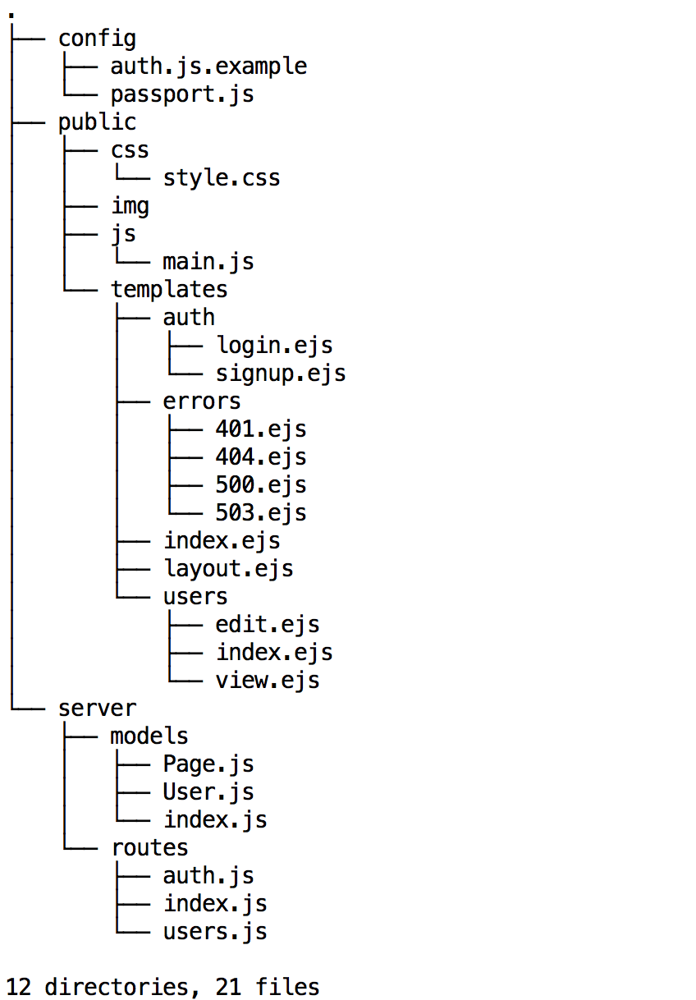

# muse 

A CMS Scaffolding Tool (Coming Soon)

[](https://www.npmjs.org/package/muse)
[](https://david-dm.org/RDFroeber/muse)
[](https://david-dm.org/RDFroeber/muse#info=devDependencies)
[](https://travis-ci.org/RDFroeber/muse)

This package is in the early stages of development. Feel free to browse the code and star for review at a later date. However, use of the module is not recommended at the current version. Basic CMS functionality will be available in the 0.2.0 release. All 0.1.x versions are for project setup and testing.

## Installation

**Note: Current Release Is Not Suitable For Use**

```sh
npm install muse -g
```

Source code can be found [here](https://github.com/RDFroeber/muse).

## Usage

While many command options are listed here, very few are actually implemented to date. I will update this list as more become available.

**Currently implemented:**

| Command           | Shorthand | Longhand           | Options              | Default | Implemented? |
|-------------------|-----------|--------------------|----------------------|---------|--------------|
| Help              | -h        | --help             |                      |         | yes          |
| Version           | -V        | --version          |                      |         | yes          |
| Style Engine      | -c        | --css <engine>     | css | sass | less    | css     | no           |
| View Engine       | -e        | --view <engine>    | dust | ejs | hbs     | dust    | no           |
| Portal            | -p        | --portal           |                      | none    | no           |
| Client Auth       | -a        | --auth <type>      | basic | oauth | both | none    | no           |
| No Blog           | -n        | --noblog           |                      | blog    | no           |
| Client Framework  | -f        | --framework <name> | angular | ember      | none    | no           |
| Backend Framework | -b        | --backend <name>   |                      | express | no           |
| Database          | -d        | --database <name>  | mongo | postgres     | mongo   | no           |


```sh
  Usage: muse [options]

  Options:

    -h, --help              output usage information
    -V, --version           output the version number
    -c, --css <engine>      add stylesheet engine support (css|sass|less) defaults to css
    -e, --view <engine>     add view engine support (dust|ejs|hbs) defaults to dust
    -p, --portal            add client portal to site where users can login
    -a, --auth <type>       choose authentication strategy (basic|oauth|both) defaults to basic
    -n, --noblog            remove blog functionality from site
    -f, --framework <name>  add client-side framework support (angular|ember) defaults to none
    -b, --backend <name>    configure server-side framework (koa|hapi|sails) defaults to express
    -d, --database <name>   configure database support (mongo|postgres) defaults to mongo
```
## File Structure



## Development Task List

Version 2.0:

* Finalize default configuration and structure
    * Basic mongoose models and CRUD operations for Users and Pages
    * Separate view routes from API routes in preparation for client-side framework support
* Admin functionality without permissions
    * Admin Dashboard
    * Site Management
    * Content Management
    * User Management
* Navigation
    * Single top level page routing
    * Additional secondary level routing
* Blog functionality
    * Basic mongoose models and CRUD operations for Blogs, and Posts
    * Single blog with multiple posts (without comments or tags)
* Multiple engine support
    * Style: css
    * Style: sass
    * Style: less
    * View: dust
    * View: ejs
    * View: handlebars

Version 2.5:

* Admin functionality with roles and multi-part permissions
    * Basic mongoose models and CRUD operations for Roles and Permissions
    * Content creation and editing
    * Content publication
    * Content deletion
    * User viewing
    * User creation and editing
* Portal Option
    * Clients can login to site
* Client User Authentication (Passport)
    * Basic user auth
    * OAuth support for Google+, Twitter, and Facebook
    * Both
* Email system support (Mailgun)
    * Account creation
    * Password change
* Blog functionality
    * Basic mongoose models and CRUD operations for Comments and Tags
    * Single blog with multiple posts (with comments and tags)


### Backlog

Version 3.0:

* Add tutorial option for base website generation
* Email system support (Mailgun)
    * Site Updates
    * Newsletters
* Add client-side framework support 
    * Angular
* Multi-blog support

Version 4.0:

* Add multiple client-side framework support 
    * Ember
* Add multiple Node.js framework support 
    * Koa
    * Hapi
    * Sails
* Multi-blog support

## Tests

Sufficient testing has not been implemented to date.

```sh
npm test
```

## Dependencies

- [commander](https://github.com/tj/commander.js): The complete solution for node.js command-line programs
- [mkdirp](https://github.com/substack/node-mkdirp): Recursively mkdir, like `mkdir -p`
- [rimraf](https://github.com/isaacs/rimraf): A deep deletion module for node (like `rm -rf`)
- [underscore](https://github.com/jashkenas/underscore): JavaScript's functional programming helper library.

## Dev Dependencies

- [chai](https://github.com/chaijs/chai): BDD/TDD assertion library for node.js and the browser. Test framework agnostic.
- [mocha](https://github.com/mochajs/mocha): A simple, flexible, fun test framework
- [sinon](https://github.com/cjohansen/Sinon.JS): JavaScript test spies, stubs and mocks.

## License

MIT
